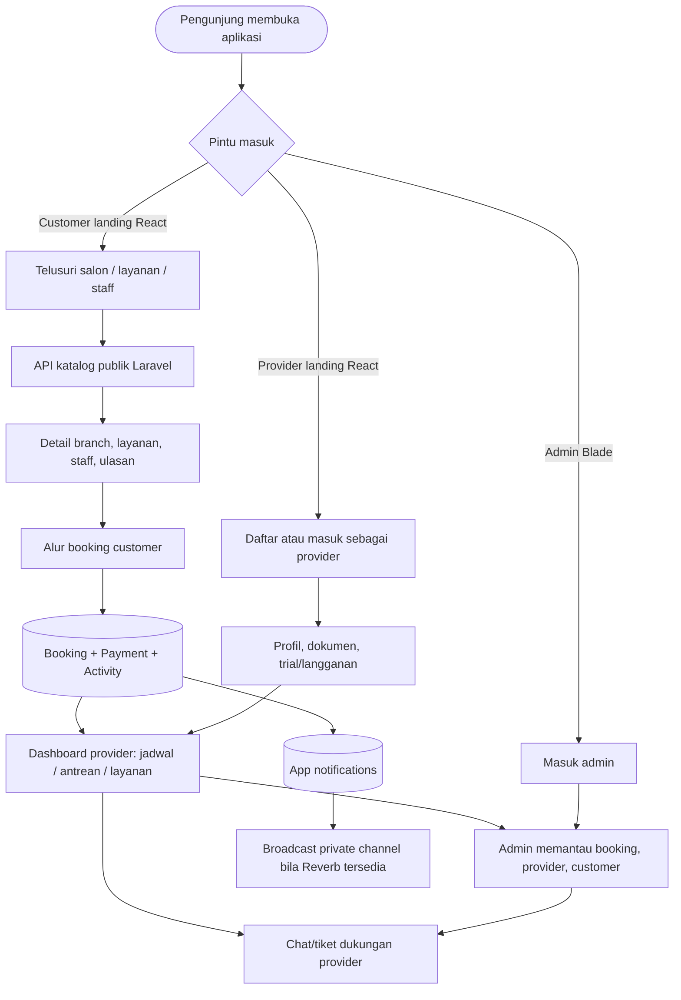
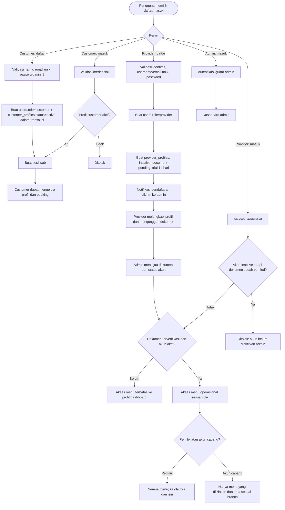
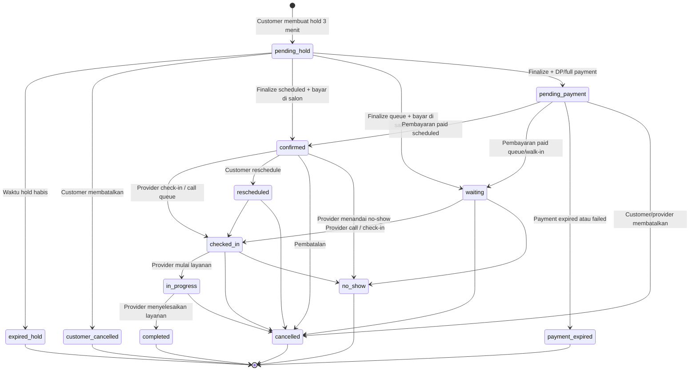
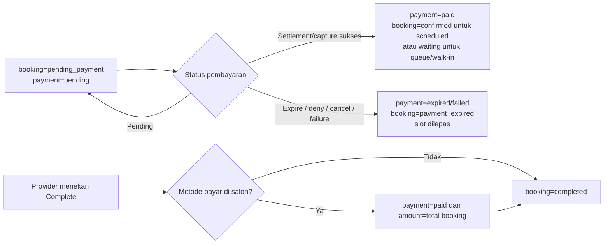
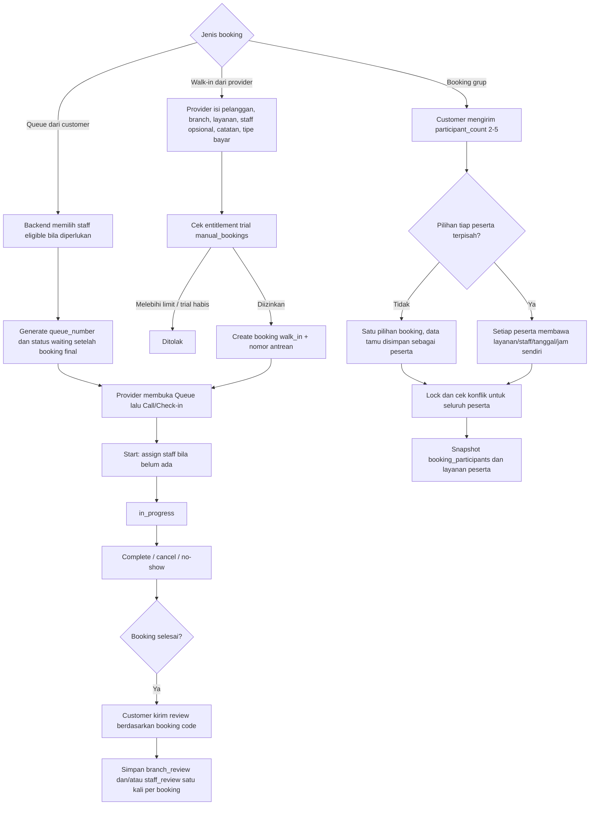
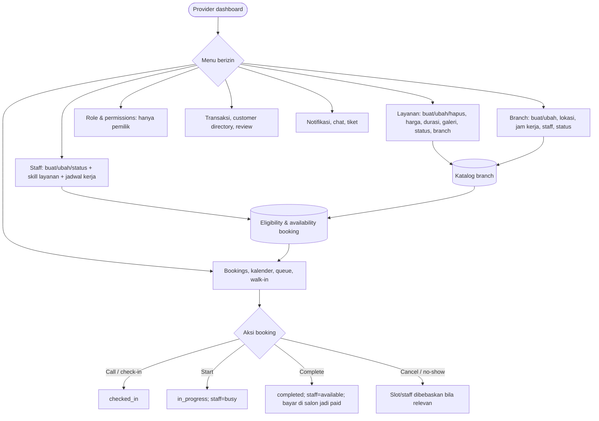
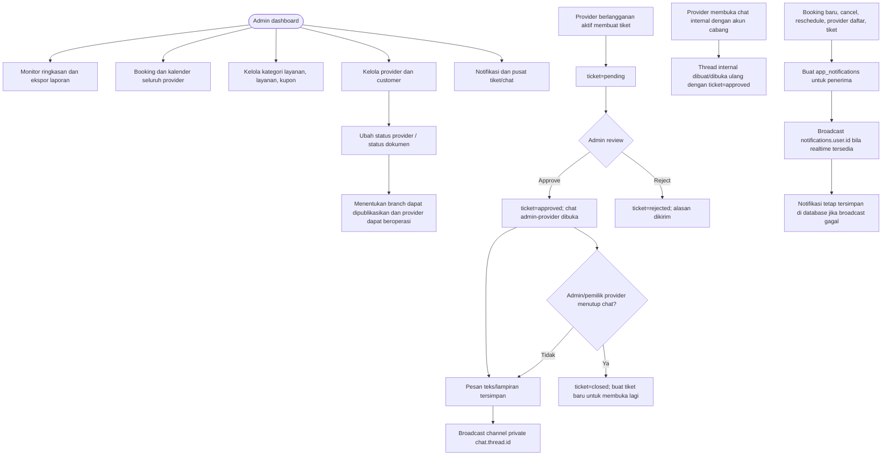

# Alur Aplikasi YouYaku

Dokumen ini memetakan alur yang **sudah diimplementasikan** di repository, per 1 Agustus 2026. Aplikasi memiliki tiga aktor: customer, provider (pemilik/akun cabang), dan admin. Backend Laravel menjadi sumber kebenaran untuk otorisasi, ketersediaan slot, status booking, transaksi, notifikasi, dan chat; customer landing dan provider landing berjalan sebagai frontend React terpisah.

> Catatan implementasi: pembayaran customer belum menjalankan proses charge Midtrans dari endpoint customer. Endpoint `payment/confirm` menandai pembayaran berhasil secara manual. Infrastruktur `MidtransService` dan webhook `/api/midtrans/notification` telah ada untuk menyelaraskan status transaksi bila gateway dipakai.

## 1. Peta alur utama



## 2. Registrasi, login, dan hak akses



Kontrol akses provider setelah login:

- Dokumen belum terverifikasi diarahkan ke profil; menu operasional dibuka setelah lolos middleware verifikasi.
- Masa trial aktif membuka operasional tetapi membatasi setiap resource: branch, layanan, staff, role, dan walk-in masing-masing maksimum 5 data.
- Trial habis tanpa langganan aktif mengunci menu yang membutuhkan verifikasi dan branch tidak dapat dibooking customer.
- Chat/tiket dukungan hanya tersedia bagi provider dengan langganan aktif.

## 3. Customer: pencarian sampai booking

```mermaid
flowchart TD
    S([Customer membuka landing]) --> Q[Search/filter kategori atau lokasi]
    Q --> Katalog[GET kategori, lokasi, branch, layanan, staff, review]
    Katalog --> PilihBranch[Pilih branch / salon]
    PilihBranch --> Detail[Halaman detail: layanan, staff, foto, lokasi, review]
    Detail --> Mulai[Pilih Book now]
    Mulai --> Mode{Tipe booking}

    Mode -->|Scheduled| L1[Pilih satu/lebih layanan]
    Mode -->|Queue| Q1[Pilih layanan untuk antrean]
    L1 --> L2[Pilih staff tertentu atau siapa saja]
    L2 --> L3[Pilih tanggal]
    L3 --> Cek[POST check-availability / GraphQL]
    Q1 --> Cek

    Cek --> Validasi[Backend melepas hold kedaluwarsa lalu validasi branch, provider, layanan, skill staff, jadwal kerja, durasi, booking aktif dan hold aktif]
    Validasi --> Ada{Pilihan tersedia?}
    Ada -->|Tidak| Ulang[Pilih layanan/staff/tanggal/jam lain]
    Ulang --> Cek
    Ada -->|Ya, scheduled| L4[Pilih jam; hanya tersimpan sebagai draft frontend]
    Ada -->|Ya, queue| Q2[Tampilkan estimasi antrean]
    L4 --> Login{Sudah login sebagai customer?}
    Q2 --> Login
    Login -->|Belum| Auth[Daftar/masuk lalu kembali ke alur]
    Auth --> Login
    Login -->|Sudah| Hold[Klik lanjut/review: POST bookings]

    Hold --> Lock[Transaction: lock staff dan booking/hold terkait; cek overlap ulang]
    Lock --> Bentrok{Slot masih valid?}
    Bentrok -->|Tidak| Rebut[Respons gagal: slot baru dipilih customer lain]
    Rebut --> Cek
    Bentrok -->|Ya| Pending[Create booking status=pending_hold, hold 3 menit, snapshot layanan/harga/durasi]
    Pending --> Review[Halaman review: detail, peserta, voucher, catatan, metode bayar, countdown]
    Review --> Waktu{Hold masih aktif?}
    Waktu -->|Tidak| Expired[status=expired_hold; slot dilepas]
    Expired --> Cek
    Waktu -->|Ya| Final[POST bookings/{id}/finalize]
    Final --> FinalLock[Lock booking, cek kepemilikan/expiry/konflik lagi, hitung ulang harga dan validasi kupon]
    FinalLock --> PayType{Metode pembayaran}
    PayType -->|Bayar di salon| Confirmed[booking=confirmed; payment=unpaid]
    PayType -->|DP / full payment| PendingPay[booking=pending_payment; payment=pending]
    Confirmed --> Activity[Index customer_activity dibuat + notifikasi provider]
    PendingPay --> Activity
```

Rincian validasi availability: branch harus aktif; provider harus aktif, dokumennya verified, serta masih trial atau berlangganan aktif; setiap layanan harus aktif, milik provider, tersedia di branch, dan mendukung tipe booking; staff harus aktif, terhubung ke branch, memiliki seluruh skill layanan, dan bekerja pada tanggal tersebut. Untuk scheduled booking, slot dihitung dari jam kerja dan menolak interval yang bertabrakan dengan booking/hold aktif atau peserta grup lain.

## 4. Status booking, pembayaran, dan operasional layanan





Aturan penting:

- Status yang memblokir slot meliputi `open`, `pending`, `pending_hold`, `pending_payment`, `confirmed`, `waiting`, `checked_in`, `inprogress`/`in_progress`, dan `rescheduled`.
- Pengecekan bentrok memakai interval waktu, bukan sekadar jam mulai yang sama. Pada create hold dan finalize, backend mengunci record terkait dan mengecek ulang di dalam database transaction.
- Klik ulang request dengan `idempotency_key` dapat mengembalikan booking yang sudah ada selama booking tersebut belum tertutup.
- Customer dapat memperpanjang hold aktif 3 menit lagi, membatalkan booking yang masih cancellable, atau reschedule booking yang statusnya diizinkan. Setiap perubahan notifikasi ke provider.
- Setelah booking final (minimal `pending_payment` atau `confirmed`), sistem membuat satu indeks `customer_activities`; hold tidak masuk aktivitas customer.

## 5. Antrean, walk-in, booking grup, dan ulasan



## 6. Provider: pengelolaan bisnis dan eksekusi booking



## 7. Admin, notifikasi, dan chat/tiket



## 8. Data yang menjadi sumber kebenaran

| Domain | Data utama | Catatan alur |
| --- | --- | --- |
| Identitas & akses | `users`, `customer_profiles`, `provider_profiles`, `admin_profiles`, provider roles/permissions | `users.role` menentukan peran; akun cabang tetap berada di organisasi provider pemilik. |
| Katalog | `provider_branches`, `services`, `service_categories`, `provider_staffs`, skill dan schedule staff | Dipakai untuk katalog publik dan kalkulasi eligibility/slot. |
| Booking | `bookings`, `booking_services`, `booking_participants`, `booking_participant_services` | Pivot menyimpan snapshot harga/durasi agar perubahan katalog tidak mengubah histori. |
| Pembayaran | `payments`, `payment_gateway_transactions` | Satu booking maksimal satu payment; data gateway hanya dibuat untuk pembayaran online. |
| Riwayat & ulasan | `customer_activities`, `branch_reviews`, `staff_reviews` | Activity hanya dibuat untuk booking final; review terkait booking yang bersangkutan. |
| Komunikasi | `app_notifications`, `chat_threads`, `chat_messages` | Pesan dan notifikasi bertahan di database, kemudian dibroadcast real-time bila tersedia. |

## 9. Daftar halaman/fitur yang dicakup

- Customer: landing, pencarian, detail salon/layanan/staff, auth, profil, booking, pembayaran, booking success/detail, activity, promo, favorites (state frontend).
- Provider: dashboard, profil/onboarding/dokumen, layanan, branch, staff, skills, schedules, role/permission, booking, kalender, queue, walk-in, payments, customer, review, notifikasi, chat, tiket, trial expired.
- Admin: login, dashboard/ekspor, booking, kalender, service/category, kupon, provider + verifikasi dokumen, customer/user, profil, notifikasi, chat, dan tiket.

## 10. Batasan implementasi yang perlu diperhatikan

1. Endpoint subscription saat ini hanya membuat tagihan/langganan pending dan order ID; pembuatan transaksi gateway subscription di endpoint tersebut masih berupa placeholder. Webhook dapat mengubah langganan menjadi aktif bila menerima notifikasi Midtrans valid.
2. Endpoint payment customer `charge` dan `status` masih mengembalikan mode pembayaran manual; `confirmByCode` dapat menandai DP/full payment sebagai lunas. Diagram menunjukkan jalur Midtrans karena service dan webhook sudah tersedia, tetapi integrasi charge customer belum dipanggil dari controller tersebut.
3. Status legacy `pending` masih diperlakukan setara dengan `pending_hold` di beberapa query agar data lama tetap aman; status baru yang digunakan alur adalah `pending_hold`.
