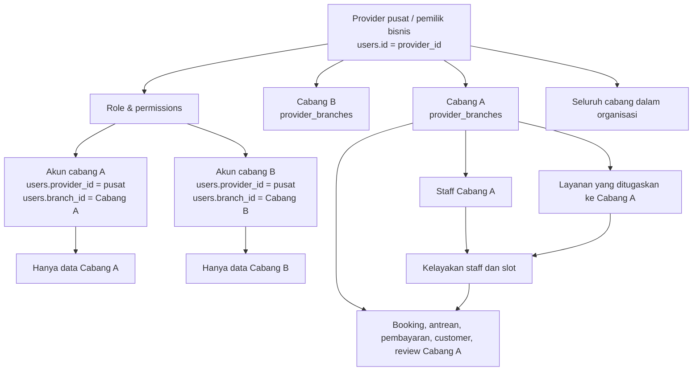
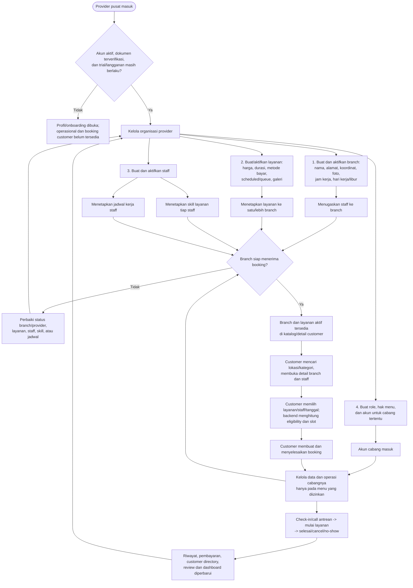
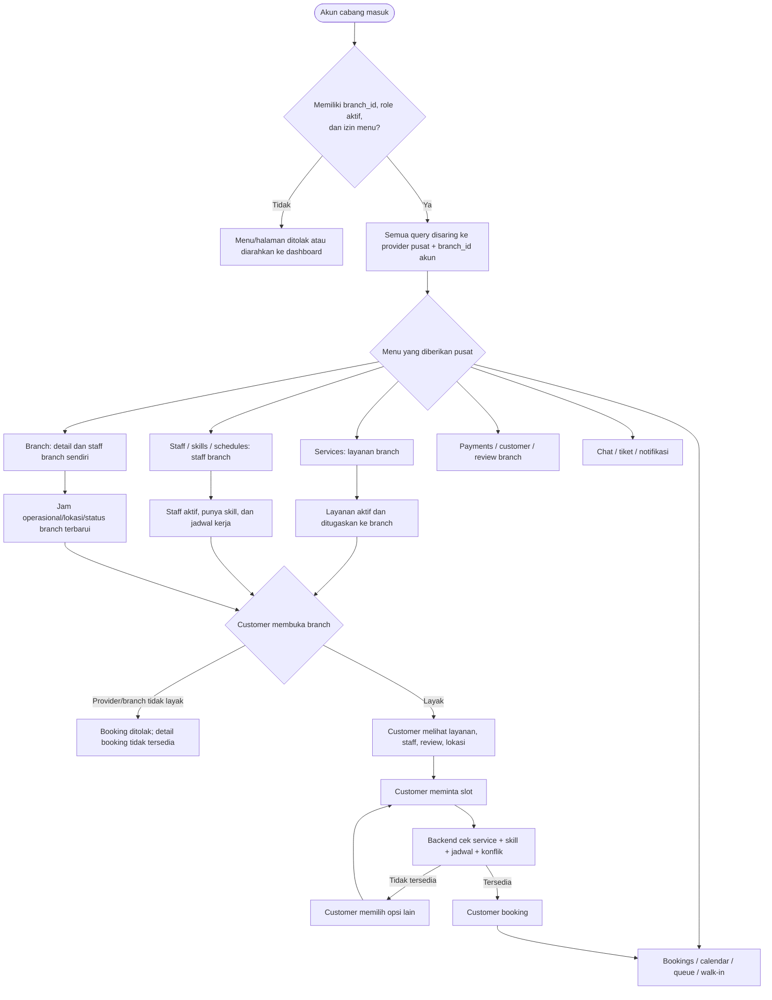
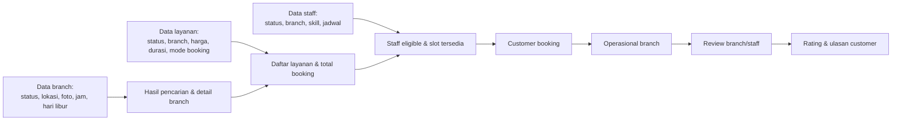

# Flowchart Provider ke Customer

Dokumen ini menjelaskan alur operasional dari **provider pusat** dan **akun cabang** sampai data tersebut tampil, dapat dipesan, lalu dilayani untuk customer. Ini terpisah dari flowchart booking customer utama.

## Struktur organisasi dan batas data

`provider_id` pada akun cabang selalu menunjuk ke provider pusat. Karena itu pusat dapat melihat seluruh data bisnis, sedangkan akun cabang otomatis dibatasi dengan `branch_id` miliknya. Selain pembatasan cabang, akun cabang juga harus memperoleh izin menu dari role yang dibuat pusat.

## Alur dari provider sampai customer bisa booking

### Kriteria agar customer dapat melakukan booking

Backend menolak booking bila salah satu syarat berikut tidak terpenuhi:

1. Branch berstatus `active`.
2. Provider berperan `provider`, profilnya `active`, dokumen `verified`, serta masih trial aktif atau punya langganan aktif.
3. Layanan yang dipilih aktif, milik provider, tersedia pada branch, dan mendukung mode scheduled atau queue yang dipilih.
4. Ada staff aktif di branch yang memiliki semua skill layanan dan bekerja pada tanggal tersebut.
5. Untuk booking scheduled, waktu berada pada jam kerja dan tidak bentrok dengan booking/hold aktif.

## Apa yang dapat dikelola: pusat vs cabang

| Area | Provider pusat | Akun cabang (hanya jika menu diizinkan) |
| --- | --- | --- |
| Dashboard | Melihat statistik, pendapatan, booking, staff, dan performa seluruh branch. | Melihat statistik dan performa milik branch sendiri. |
| Profil & dokumen provider | Mengubah profil bisnis, unggah dokumen, onboarding, dan password akun pusat. | Bisa melihat profil dan mengubah password akun sendiri; tidak dapat mengubah profil utama atau dokumen provider. |
| Branch | Membuat, melihat, mengubah, aktif/nonaktif, menugaskan staff, dan menghapus seluruh branch. | Hanya melihat serta mengubah branch sendiri, mengatur staff branch sendiri, dan aktif/nonaktif branch sendiri. Tidak dapat membuat atau menghapus branch. |
| Layanan | Membuat serta mengubah seluruh layanan; dapat menetapkan layanan ke beberapa branch. | Hanya melihat layanan yang berlaku di branch sendiri. Dapat membuat layanan untuk branch sendiri dan mengelola layanan yang terlihat bila diberi menu `services`; penetapan branch tidak dapat menghapus penugasan branch lain. |
| Staff | Membuat, mengubah, aktif/nonaktif, atau menghapus staff di seluruh branch. | Mengelola staff branch sendiri; sistem memaksa `branch_id` ke branch akun tersebut saat membuat staff. |
| Skill & jadwal staff | Mengelola seluruh staff dalam organisasi. | Mengelola skill dan jadwal staff branch sendiri. Ini langsung menentukan staff eligible dan slot customer. |
| Role, permission, akun cabang | Satu-satunya pihak yang dapat membuat/mengubah/nonaktifkan role dan akun cabang. | Tidak dapat mengelola role atau akun cabang. |
| Booking & kalender | Melihat dan menjalankan operasional booking di semua branch. | Melihat dan menjalankan operasional hanya booking branch sendiri. |
| Queue & walk-in | Mengelola antrean dan membuat walk-in seluruh branch. | Mengelola antrean dan membuat walk-in pada branch sendiri. |
| Payment, customer, review | Melihat data seluruh provider. | Hanya melihat transaksi, customer yang pernah booking, dan review dari branch sendiri. |
| Notifikasi, chat, tiket | Menerima notifikasi sesuai menu; dapat chat internal dengan akun cabang. | Menerima notifikasi sesuai menu; dapat chat internal bila berizin. Support chat/tiket memerlukan langganan aktif. |

> Catatan penting: izin menu bukan hanya tampilan. Middleware `provider.menu:*` memeriksa izin server-side. Jadi akun cabang tidak bisa membuka URL fitur yang tidak diizinkan, sekalipun mengetahui alamat halamannya.

## Detail alur akun cabang

## Dampak setiap data provider pada pengalaman customer

## Urutan setup yang disarankan untuk provider pusat

1. Lengkapi profil bisnis dan unggah dokumen; tunggu verifikasi admin.
2. Pastikan trial masih aktif atau aktifkan paket langganan.
3. Buat branch, lengkapi lokasi, foto, jam kerja, hari kerja, dan hari libur.
4. Buat layanan aktif dan tetapkan setiap layanan ke branch yang memang menyediakannya.
5. Tambahkan staff aktif ke masing-masing branch.
6. Petakan skill layanan dan jadwal kerja staff.
7. Buat akun cabang dengan role serta menu minimal yang dibutuhkan.
8. Periksa status branch, layanan, staff, dan jadwal sebelum dipublikasikan ke customer.

Dengan urutan ini, customer akan mendapatkan detail salon yang lengkap, hanya melihat staff yang sesuai, serta menerima slot yang benar-benar dapat dilayani oleh branch tersebut.
